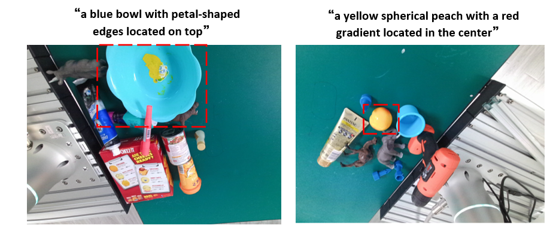

# HRI-Grasp

 The RefGrasp is a new and challenging visual grounding dataset designed for robotic scenarios. RefGrasp contains a total of 2,500 RGB-D images and semantic masks, including 88 object categories such as food, fruits, cosmetics, toys, and tools, covering 190 scenes. The RefGrasp contains a total of 21,696 objects, each with three distinct descriptions, totaling 65,088 language descriptions.

For example:

link: https://pan.baidu.com/s/1fwygyjScO0I822f_Dd_5UQ?pwd=cxvf    code: cxvf
